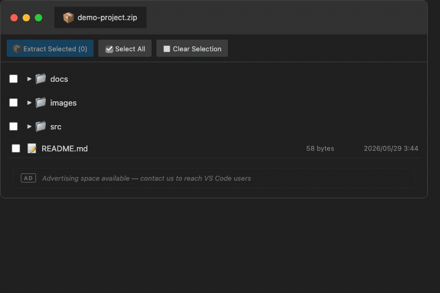

# Zip Viewer - VS Code Extension

A VS Code extension that allows you to browse and extract various compressed archive file formats directly within the editor.



## Supported Formats

### ZIP Format
* `.zip` - Including password-protected archives

### 7-Zip Format
* `.7z`

### TAR Format (Uncompressed)
* `.tar`

### GZIP Compressed TAR
* `.tar.gz`
* `.tgz`

### XZ Compressed TAR
* `.tar.xz`

### BZIP2 Compressed TAR
* `.tar.bz2`
* `.tbz2`
* `.tz2`

### Compress Compressed TAR
* `.tar.Z`
* `.taz`
* `.taZ`

### LZIP Compressed TAR
* `.tar.lz`
* `.tlz`

### LZMA Compressed TAR
* `.tar.lzma`

## Features

### 📁 File List Display
* Display file names, sizes, and timestamps
* Tree view for directory hierarchy
* Expandable and collapsible folders

### 👁️ File Preview
* Preview first lines of files on mouse down
* Close preview on mouse up or mouse leave
* Customizable preview line count in settings

### 🔐 Password Protection Support
* Support for password-protected ZIP files
* Password remembered for the same file during session

### 📤 File & Folder Extraction
* Right-click to extract individual files
* Right-click to extract entire folders
* Select multiple items with checkboxes for batch extraction
* Choose custom extraction destination

## How to Use

1. Open a compressed file (.zip, .7z, .tar.gz, etc.) in VS Code
2. The file list will be displayed
3. Click folder icons to expand hierarchy
4. Mouse down on file names to preview content
5. Right-click to extract files/folders, or use checkboxes for batch extraction

## Settings

Customize the preview line count in `settings.json`:

```json
{
  "zipViewer.previewLineCount": 20
}
```

Default is 20 lines.

## Advertising

This extension may display advertisements in designated advertising spaces within the interface. Revenue from advertisements is used for the development, maintenance, and improvement of the extension. Advertisements are displayed discreetly and do not interfere with the core functionality of the extension.

## Privacy

This extension operates entirely locally and does not transmit your files or data externally. All processing is performed on your computer.

## Limitations

* Very large archive files may take time to load
* Binary file previews may not display correctly
* LZO format (.tar.lzo) and Zstandard format (.tar.zst, .tzst) are not currently supported

## Dependencies

* `unzipper` - ZIP format support
* `7zip-bin` - 7Z format support
* `node-7z` - 7-Zip binary interface
* `tar` - TAR format support
* `lzma-native` - XZ/LZMA compression support
* `unbzip2-stream` - BZIP2 compression support

## License

This software is provided under a proprietary license. The source code is closed and unauthorized copying, distribution, or modification is prohibited. Use of this extension is subject to the VS Code Marketplace Terms of Use.

Copyright (c) 2024 Takeshi Fuchi. All rights reserved.

## Support

For issues or feature requests, please contact us through the review section or support link on the VS Code Marketplace.

## Privacy Policy

Zip Viewer does not collect, store, or transmit any user data...


## Version History

### 2.1.0
* Added batch extraction for multiple files and folders
* UI improvements and performance optimization
* Added 7Z format support

### 2.0.0
* Support for 17 compression formats
* UI improvements (VS Code theme color support)
* Thousand separator display for file sizes

### 1.0.0
* Initial release
* Support for ZIP, TAR, TAR.GZ, TAR.XZ, TAR.BZ2


